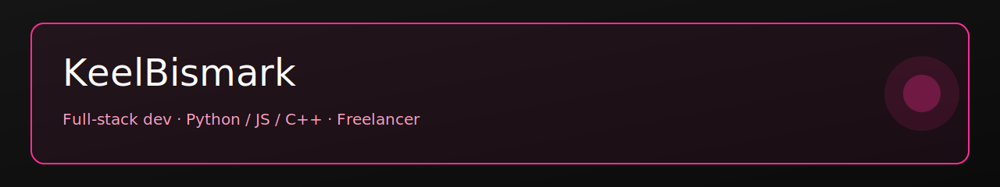

<!-- README for GitHub profile: KeelBismark -->
<!-- Accent color: #FF2D95 / Dark theme -->

**Full-stack dev — Python / JS / C++ — Open for freelance**  
*Languages shown below — available for freelance work. DM on Discord for quick collabs.*

---

## About me
I'm a friendly full-stack developer focused on automation and tooling. I work primarily with Python, JavaScript/TypeScript and C++. I take freelance projects — small to medium automation, web tooling and integration tasks.

**Open for freelance — DM on Discord:** `justkeel.6707`

---

## Highlighted skills
I mainly work with:

- **Languages:** Python, JavaScript, TypeScript, C++, Java, Assembly (and others).
- **Frameworks / Tools:** React, Flask, Docker, Git, Linux, VS Code, macOS, Windows.
- **Currently learning / exploring:** C#, Go.

---

## GitHub stats & languages
<!-- Top languages card -->
  

---

## Pinned projects
`coming soon`

---

## Links
- Website: `coming soon`  
- Discord: `justkeel.6707`  
- LinkedIn: `coming soon`

---

## Last updated
_Last updated: **PLACEHOLDER**_

