<!-- README for GitHub profile: KeelBismark -->
<!-- Accent color: #FF2D95 / Dark theme -->

  

<h1 align="center">KeelBismark</h1>

<b>Full-stack dev — Python / JS / C++ — Open for freelance</b>

💬 DM on Discord: <code>justkeel.6707</code>

---

  
  
  
  

<h3 align="center">🛠 Tech Stack</h3>

  <b>Languages:</b> Java · JavaScript · TypeScript · Python · C++ · Bash 
  <b>Frameworks & Tools:</b> Spring Boot · Node.js · Flask · Electron · Gradle · Docker 
  <b>Databases:</b> SQLite · MySQL · PostgreSQL 
  <b>Other:</b> Git · GitHub Actions · Nginx · WebSocket

<h3 align="center">💻 My Rig & OS</h3>

  
  
   
  
  
  

<h3 align="center">📊 GitHub Stats</h3>

  

  
  

---

Last updated: 12.08.2025

