### 💻 Full-stack Developer | Python · JavaScript · C++ | Open for Freelance

---

## 🛠️ Tech Stack

---

## 💻 Hardware

 

---

## 📊 GitHub Stats

---

## 🎯 Recent Activity

 

---

## 📫 Contact

**Available for freelance projects** • Response time: <24h • Moscow (UTC+3)

---

**"Engineering logic. Building stability."**

